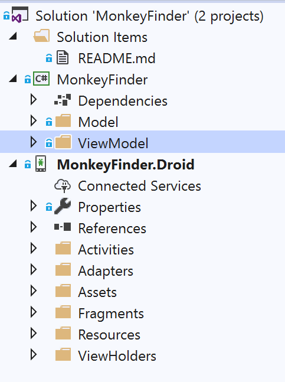
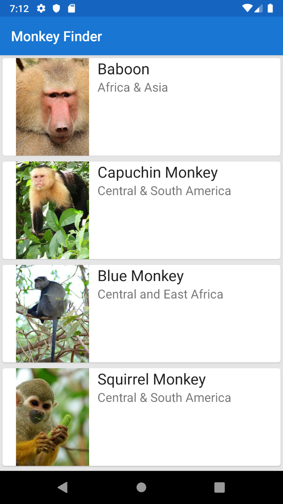
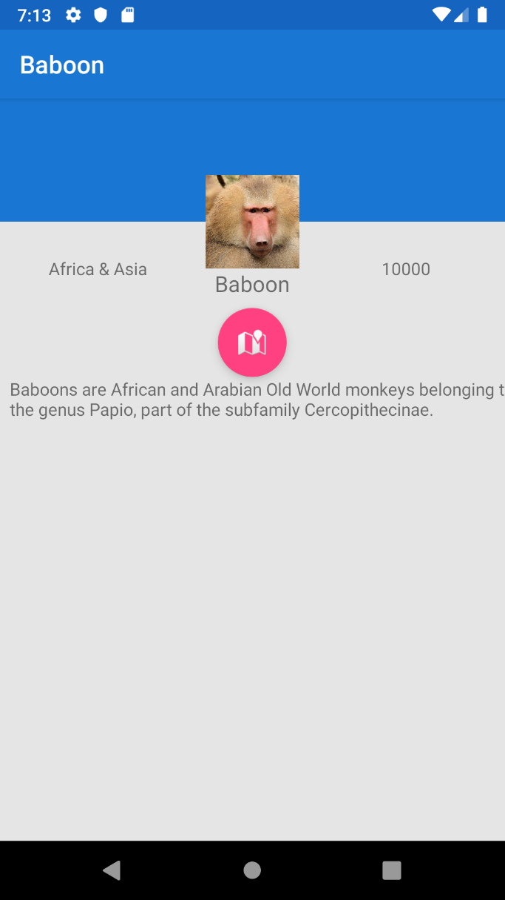

# Xamarin Monkeys - Hands On Lab

Today we will build a cloud connected [Xamarin.Android](https://docs.microsoft.com/xamarin/) application that will display a list of Monkeys from around the world. We will start by building the business logic backend that pulls down json-ecoded data from a RESTful endpoint. We will then leverage [Xamarin.Essentials](https://docs.microsoft.com/xamarin/essentials/index) to find the closest monkey to us and also show the monkey on a map. Finally, we will connect it to an Azure backend leveraging [Azure Cosmos DB](https://azure.microsoft.com/services/cosmos-db/) and [Azure Functions](https://azure.microsoft.com/en-us/services/functions/) in just a few lines of code.

## Setup Guide
Follow our simple [setup guide](https://github.com/xamarin/dev-days-labs/raw/master/Xamarin%20Workshop%20Setup.pdf) to ensure you have Visual Studio and Xamarin setup and ready to deploy.

## Mobile App Walkthrough

### 1. Open Solution in Visual Studio

1. Open **Start/MonkeyFinder.sln**

This MonkeyFinder contains 2 projects

* MonkeyFinder  - Shared .NET Standard project that will have all shared code (model, view models, and services)
* MonkeyFinder.Droid - Xamarin.Android application



The **MonkeyFinder** project also has blank code files that we will use during the Hands on Lab. All of the code that we modify will be in this project or the **MonkeyFinder.Droid** project for the workshop.

### 2. NuGet Restore

All projects have the required NuGet packages already installed, so there will be no need to install additional packages during the Hands on Lab. The first thing that we must do is restore all of the NuGet packages from the internet.

1. **Right-click** on the **Solution** and selecting **Restore NuGet packages...**


### 3. Model

We will download details about the monkey and will need a class to represent it.

We can easily convert our json file located at [montemagno.com/monkeys.json]("https://montemagno.com/monkeys.json) by using [quicktype.io](https://app.quicktype.io/) and pasting the raw json into quicktype to generate our C# classes. Ensure that you set the Name to `Monkey` and the generated namespace to `MonkeyFinder.Model` and select C#. Here is a direct URL to the code: [https://app.quicktype.io?share=W43y1rUvk1FBQa5RsBC0](https://app.quicktype.io?share=W43y1rUvk1FBQa5RsBC0)


1. Open `Model/Monkey.cs`
2. In `Monkey.cs`, copy/paste the following:

```csharp
public partial class Monkey
{
    [JsonProperty("Name")]
    public string Name { get; set; }

    [JsonProperty("Location")]
    public string Location { get; set; }

    [JsonProperty("Details")]
    public string Details { get; set; }

    [JsonProperty("Image")]
    public Uri Image { get; set; }

    [JsonProperty("Population")]
    public long Population { get; set; }

    [JsonProperty("Latitude")]
    public double Latitude { get; set; }

    [JsonProperty("Longitude")]
    public double Longitude { get; set; }
}

public partial class Monkey
{
    public static Monkey[] FromJson(string json) => JsonConvert.DeserializeObject<Monkey[]>(json, MonkeyFinder.Model.Converter.Settings);
}

public static class Serialize
{
    public static string ToJson(this Monkey[] self) => JsonConvert.SerializeObject(self, MonkeyFinder.Model.Converter.Settings);
}

internal static class Converter
{
    public static readonly JsonSerializerSettings Settings = new JsonSerializerSettings
    {
        MetadataPropertyHandling = MetadataPropertyHandling.Ignore,
        DateParseHandling = DateParseHandling.None,
        Converters =
        {
            new IsoDateTimeConverter { DateTimeStyles = DateTimeStyles.AssumeUniversal }
        },
    };
}
```

### 4. Create ObservableCollection of Monkeys

We will use an `ObservableCollection<Monkey>` that will be cleared and then loaded with **Monkey** objects. We use an `ObservableCollection` because it has built-in support to raise `CollectionChanged` events when we Add or Remove items from the collection. This means we don't call `OnPropertyChanged` when updating the collection. Although we won't be using these mechanisms withing the Xamarin.Android project, they are still features you could use with a classic Xamarin.Android project.

1. In `MonkeysViewModel.cs` declare an auto-property which we will initialize to an empty collection. Also, we can set our Title to `Monkey Finder`.

```csharp
public class MonkeysViewModel
{
    //...
    public ObservableCollection<Monkey> Monkeys { get; }
    public  MonkeysViewModel()
    {
        Monkeys = new ObservableCollection<Monkey>();
    }
    //...
}
```

### 5. Create GetMonkeysAsync Method

We are ready to create a method named `GetMonkeysAsync` which will retrieve the monkey data from the internet. We will first implement this with a simple HTTP request, and later update it to grab and sync the data from Azure!

1. In `MonkeysViewModel.cs`, create a method named `GetMonkeysAsync` with that returns `async Task`:

```csharp
public class MonkeysViewModel
{
    //...
	HttpClient httpClient;
    HttpClient Client => httpClient ?? (httpClient = new HttpClient());
    public async Task GetMonkeysAsync()
    {
    }
    //...
}
```

3. In `GetMonkeysAsync`, add some scaffolding for try/catch/finally blocks

```csharp
async Task GetMonkeysAsync()
{
    try
    {

    }
    catch (Exception ex)
    {

    }
    finally
    {

    }

}
```

4. In the `try` block of `GetMonkeysAsync`, we can get the monkeys from our Data Service.

```csharp
public async Task GetMonkeysAsync()
{
    ...
    try
    {
        var json = await Client.GetStringAsync("https://montemagno.com/monkeys.json");
        var monkeys =  Monkey.FromJson(json);
    }
    ... 
}
```

6. Inside of the `using`, clear the `Monkeys` property and then add the new monkey data:

```csharp
public async Task GetMonkeysAsync()
{
    //...
    try
    {
        var json = await Client.GetStringAsync("https://montemagno.com/monkeys.json");
        var monkeys =  Monkey.FromJson(json);

        Monkeys.Clear();
        foreach (var monkey in monkeys)
            Monkeys.Add(monkey);
    }
    //...
}
```

7. In `GetMonkeysAsync`, add this code to the `catch` block to display an error if the data retrieval fails:

```csharp
async Task GetMonkeysAsync()
{
    //...
    catch(Exception ex)
    {
        Debug.WriteLine($"Unable to get monkeys: {ex.Message}");
    }
    //...
}
```

8. Ensure the completed code looks like this:

```csharp
public async Task GetMonkeysAsync()
{
    try
    {
        var json = await Client.GetStringAsync("https://montemagno.com/monkeys.json");
        var monkeys =  Monkey.FromJson(json);

        Monkeys.Clear();
        foreach (var monkey in monkeys)
            Monkeys.Add(monkey);
    }
    catch (Exception ex)
    {
        Debug.WriteLine($"Unable to get monkeys: {ex.Message}");
    }
    finally
    {

    }
}
```

Our main method for getting data is now complete!

## 7. Build The Monkeys User Interface
It is now time to build the Xamarin.Android user interface in the Xamarin.Android project. Our end result is to build a page that looks like this:



1. In `Resources/layout/activity_main.axml`, create a `FrameLayout` that will house our fragments. You can also add a `Toolbar` to manage navigation!

```xml
<?xml version="1.0" encoding="utf-8"?>
<android.support.design.widget.CoordinatorLayout xmlns:android="http://schemas.android.com/apk/res/android"
    xmlns:app="http://schemas.android.com/apk/res-auto"
    xmlns:tools="http://schemas.android.com/tools"
    android:layout_width="match_parent"
    android:layout_height="match_parent"
    tools:context=".MainActivity">

    <android.support.design.widget.AppBarLayout
        android:layout_width="match_parent"
        android:layout_height="wrap_content"
        android:theme="@style/AppTheme.AppBarOverlay">

        <android.support.v7.widget.Toolbar
            android:id="@+id/toolbar"
            android:layout_width="match_parent"
            android:layout_height="?attr/actionBarSize"
            android:background="?attr/colorPrimary"
            app:popupTheme="@style/AppTheme.PopupOverlay" />

    </android.support.design.widget.AppBarLayout>
    <FrameLayout xmlns:android="http://schemas.android.com/apk/res/android"
        xmlns:app="http://schemas.android.com/apk/res-auto"
        xmlns:tools="http://schemas.android.com/tools"
        android:layout_width="match_parent"
        android:layout_height="match_parent"
        app:layout_behavior="@string/appbar_scrolling_view_behavior"
        android:background="#e5e5e5"
        android:id="@+id/main_container" />
</android.support.design.widget.CoordinatorLayout>
```

2. We can create our first main fragment layout by creating a `RecyclerView` which will display a list of our monkeys. Create a new `.axml` file called `Resources/layout/fragment_monkeys.axml`.

```xml
<?xml version="1.0" encoding="utf-8"?>
<android.support.design.widget.CoordinatorLayout xmlns:android="http://schemas.android.com/apk/res/android"
    xmlns:tools="http://schemas.android.com/tools"
    android:layout_width="match_parent"
    android:layout_height="match_parent"
    xmlns:app="http://schemas.android.com/apk/res-auto">

  <RelativeLayout
      android:layout_width="match_parent"
      android:layout_height="match_parent">

    <android.support.v7.widget.RecyclerView
        android:id="@+id/monkeysRecyclerView"
        android:layout_width="match_parent"
        android:layout_height="match_parent"
        android:background="#e5e5e5"
        android:scrollbars="vertical"
        app:layout_behavior="@string/appbar_scrolling_view_behavior" />

  </RelativeLayout>

</android.support.design.widget.CoordinatorLayout>
```

3. We need to display a wonderful monkey item which you can create a new `.axml` file called `Resources/layout/monkey_item.axml` and use the following code:

```xml
<?xml version="1.0" encoding="utf-8"?>
<android.support.v7.widget.CardView xmlns:android="http://schemas.android.com/apk/res/android"
    xmlns:app="http://schemas.android.com/apk/res-auto"
    xmlns:tools="http://schemas.android.com/tools"
    android:id="@+id/cardView"
    android:layout_width="match_parent"
    android:layout_height="150dp"
    app:cardElevation="1dp"
    app:cardCornerRadius="4dp"
    app:cardUseCompatPadding="true">

    <android.support.constraint.ConstraintLayout
        android:layout_width="match_parent"
        android:layout_height="match_parent">

        <ImageView
            android:id="@+id/monkeyImageView"
            android:layout_width="wrap_content"
            android:layout_height="wrap_content"
            android:layout_marginStart="16dp"
            app:layout_constraintBottom_toBottomOf="parent"
            app:layout_constraintStart_toStartOf="parent"
            app:layout_constraintTop_toTopOf="parent"
            tools:srcCompat="@tools:sample/avatars" />

        <TextView
            android:id="@+id/monkeyNameTextView"
            android:layout_width="wrap_content"
            android:layout_height="wrap_content"
            android:layout_marginStart="8dp"
            android:text="TextView"
            android:textAppearance="@style/TextAppearance.AppCompat.Large"
            app:layout_constraintStart_toEndOf="@+id/monkeyImageView"
            app:layout_constraintTop_toTopOf="@+id/monkeyImageView" />

        <TextView
            android:id="@+id/monkeyLocationTextView"
            android:layout_width="wrap_content"
            android:layout_height="wrap_content"
            android:layout_marginStart="8dp"
            android:text="TextView"
            android:textAppearance="@style/TextAppearance.AppCompat.Medium"
            app:layout_constraintStart_toEndOf="@+id/monkeyImageView"
            app:layout_constraintTop_toBottomOf="@+id/monkeyNameTextView" />
    </android.support.constraint.ConstraintLayout>
</android.support.v7.widget.CardView>
```

2. There's a lot to unpack with setting up our project with fragments. So let's go ahead and modify our `Activities/MainActivity.cs` to specify the first fragment transaction. Don't worry if code doesn't compile here as we have a few steps in-order to get our fragment created using `RecyclerView`.

```csharp
    [Activity(Label = "@string/app_name", Theme = "@style/AppTheme.NoActionBar", MainLauncher = true)]
    public class MainActivity : AppCompatActivity
    {
        private Android.Support.V4.App.FragmentManager fragmentManager;
        private Android.Support.V4.App.Fragment monkeysFragment;
        public Android.Support.V7.Widget.Toolbar _toolbar;
        protected override void OnCreate(Bundle savedInstanceState)
        {
            base.OnCreate(savedInstanceState);

            Xamarin.Essentials.Platform.Init(this, savedInstanceState);

            SetContentView(Resource.Layout.activity_main);

            Android.Support.V7.Widget.Toolbar toolbar = FindViewById<Android.Support.V7.Widget.Toolbar>(Resource.Id.toolbar);
            _toolbar = toolbar;
            SetSupportActionBar(toolbar);

            fragmentManager = SupportFragmentManager;

            monkeysFragment = new MonkeyListFragment();

            fragmentManager.BeginTransaction().Replace(Resource.Id.main_container, monkeysFragment).Commit();
        }
        public override void OnRequestPermissionsResult(int requestCode, string[] permissions, [GeneratedEnum] Permission[] grantResults)
        {
            Xamarin.Essentials.Platform.OnRequestPermissionsResult(requestCode, permissions, grantResults);

            base.OnRequestPermissionsResult(requestCode, permissions, grantResults);
        }
    }
```

5. Next, because we want to use the `ViewHolder` pattern with our `RecyclerView`, we can define a new file called `ViewHolders/MonkeyViewHolder.cs` which will hold a reference to our view elements.

```csharp
    public class MonkeyViewHolder : RecyclerView.ViewHolder
    {
        public ImageView Image { get; set; }
        public TextView Name { get; set; }
        public TextView Location { get; set; }
        public MonkeyViewHolder(View view, Action<int> listener) : base(view)
        {
            Image = view.FindViewById<ImageView>(Resource.Id.monkeyImageView);
            Name = view.FindViewById<TextView>(Resource.Id.monkeyNameTextView);
            Location = view.FindViewById<TextView>(Resource.Id.monkeyLocationTextView);

            view.Click += (sender, e) => listener(base.LayoutPosition);
        }
    }
```

4. Much of this won't make too much sense until you start to work on the `RecyclerView` side of things. So we're going to start by creating a new `Adapter` called `Adapters/MonkeysRecyclerViewAdapter.cs`. Inside we will be using `Glide` which is a popular image loading library within the Android ecosystem to handle our monkey images. We'll be binding to a view holder we created previously.

```csharp
public class MonkeysRecyclerViewAdapter : RecyclerView.Adapter
    {
        private Context _context;
        private MonkeysViewModel _viewModel;
        public event EventHandler<int> ItemClick;
        public override int ItemCount => _viewModel.Monkeys.Count;

        public MonkeysRecyclerViewAdapter(Context context, MonkeysViewModel viewModel)
        {
            _context = context;
            _viewModel = viewModel;
        }

        public override void OnBindViewHolder(RecyclerView.ViewHolder holder, int position)
        {
            MonkeyViewHolder vh = holder as MonkeyViewHolder;
            Glide.With(_context).Load(_viewModel.Monkeys[position].Image.ToString()).CenterCrop().Override(300, 400).Into(vh.Image);
            vh.Name.Text = _viewModel.Monkeys[position].Name;
            vh.Location.Text = _viewModel.Monkeys[position].Location;
        }

        public override RecyclerView.ViewHolder OnCreateViewHolder(ViewGroup parent, int viewType)
        {
            View view = LayoutInflater.From(parent.Context).Inflate(Resource.Layout.monkey_item, parent, false);
            MonkeyViewHolder vh = new MonkeyViewHolder(view, OnClick);
            return vh;
        }

        void OnClick(int position)
        {
            ItemClick?.Invoke(this, position);
        }
    }
```

3. Now we're ready to create our `Fragments/MonkeyListFragment`. Create a new fragment and add the following code

```csharp
    public class MonkeyListFragment : Android.Support.V4.App.Fragment
    {
        private MainActivity _activity;
        private Android.Support.V4.App.FragmentManager fragmentManager;
        private Android.Support.V4.App.Fragment monkeyDetailFragment;
        private MonkeysViewModel monkeysViewModel = new MonkeysViewModel();

        public override View OnCreateView(LayoutInflater inflater, ViewGroup container, Bundle savedInstanceState)
        {
            _activity._toolbar.Title = "Monkey Finder";
            View view = inflater.Inflate(Resource.Layout.fragment_monkeys, container, false);
            var recyclerView = view.FindViewById<RecyclerView>(Resource.Id.monkeysRecyclerView);

            Task.Run(async () => {
                await monkeysViewModel.GetMonkeysAsync();
            }).Wait();

            MonkeysRecyclerViewAdapter adapter = new MonkeysRecyclerViewAdapter(Context, monkeysViewModel);
            adapter.ItemClick += Adapter_ItemClick;
            recyclerView.SetAdapter(adapter);
            LinearLayoutManager layoutManager = new LinearLayoutManager(Context);
            recyclerView.SetLayoutManager(layoutManager);
            return view;
        }

        private void Adapter_ItemClick(object sender, int e)
        {
            var monkey = monkeysViewModel.Monkeys[e];
            monkeyDetailFragment = new MonkeyDetailFragment(monkey);
            fragmentManager.BeginTransaction().Replace(Resource.Id.main_container, monkeyDetailFragment).AddToBackStack(monkey.Name).Commit();
        }

        public override void OnAttach(Context context)
        {
            base.OnAttach(context);
            var activity = context as MainActivity;
            _activity = activity;
            fragmentManager = activity.SupportFragmentManager;
        }

    }
```

### 8. Run the App

1. In Visual Studio, set the Android project as the startup project 

2. In Visual Studio, click "Start Debugging"
    - If you are having any trouble, see the Setup guides below for your runtime platform

#### Android Setup

Set the MonkeyFinder.Droid as the startup project and select your emulator or device to start debugging. With help for deployment head over to our [documentation](https://docs.microsoft.com/xamarin/android/deploy-test/debugging/).

### 9. ViewModel for Details

1. Inside of our `ViewModel/MonkeyDetailsViewModel.cs` will house our logic for assigning the monkey to the view model and also opening a map page using Xamarin.Essentials to the monkey's location.

```csharp
public class MonkeyDetailsViewModel
{
    public MonkeyDetailsViewModel()
    {
    }

    public MonkeyDetailsViewModel(Monkey monkey)
        : this()
    {
        Monkey = monkey;
    }
    Monkey monkey;
    public Monkey Monkey
    {
        get => monkey;
        set
        {
            if (monkey == value)
                return;

            monkey = value;
        }
    }
}
```

2. Now we can create a method `OpenMapAsync` to open the map to the monkey's location:

```csharp
public class MonkeyDetailsViewModel
{
    public async Task OpenMapAsync()
    {
        try
        {
            await Maps.OpenAsync(Monkey.Latitude, Monkey.Longitude);
        }
        catch (Exception ex)
        {
            Debug.WriteLine($"Unable to launch maps: {ex.Message}");
        }
    }
}
```

### 10. Create Details UI

Let's add UI to our details screen. Our end goal is to get a fancy profile screen like this:



### 11. Navigate to the second fragment

Now, let's add navigation to a second fragment that displays monkey details!

1. First we will create a new layout for this fragment called `Resources/layout/fragment_monkey_detail.axml`.

```xml
<?xml version="1.0" encoding="utf-8"?>
<android.support.constraint.ConstraintLayout xmlns:android="http://schemas.android.com/apk/res/android"
    xmlns:app="http://schemas.android.com/apk/res-auto"
    xmlns:tools="http://schemas.android.com/tools"
    android:layout_width="match_parent"
    android:layout_height="match_parent">

    <View
        android:id="@+id/view2"
        android:layout_width="match_parent"
        android:layout_height="100dp"
        android:background="@color/colorPrimary" />

    <ImageView
        android:id="@+id/monkeyImageView"
        android:layout_width="wrap_content"
        android:layout_height="wrap_content"
        android:layout_marginStart="8dp"
        android:layout_marginEnd="8dp"
        app:layout_constraintBottom_toBottomOf="@+id/view2"
        app:layout_constraintEnd_toEndOf="parent"
        app:layout_constraintStart_toStartOf="parent"
        app:layout_constraintTop_toBottomOf="@+id/view2"
        tools:srcCompat="@tools:sample/avatars" />

    <TextView
        android:id="@+id/monkeyLocationTextView"
        android:layout_width="wrap_content"
        android:layout_height="wrap_content"
        android:lines="2"
        android:minLines="2"
        android:layout_marginStart="8dp"
        android:layout_marginTop="28dp"
        android:layout_marginEnd="8dp"
        android:text="TextView"
        app:layout_constraintEnd_toStartOf="@+id/monkeyImageView"
        app:layout_constraintHorizontal_bias="0.447"
        app:layout_constraintStart_toStartOf="parent"
        app:layout_constraintTop_toBottomOf="@+id/view2" />

    <TextView
        android:id="@+id/monkeyPopulationTextView"
        android:layout_width="wrap_content"
        android:layout_height="wrap_content"
        android:layout_marginStart="8dp"
        android:layout_marginTop="28dp"
        android:layout_marginEnd="8dp"
        android:text="TextView"
        app:layout_constraintEnd_toEndOf="parent"
        app:layout_constraintHorizontal_bias="0.53"
        app:layout_constraintStart_toEndOf="@+id/monkeyImageView"
        app:layout_constraintTop_toBottomOf="@+id/view2" />

    <android.support.design.widget.FloatingActionButton
        android:id="@+id/showOnMapButton"
        android:layout_width="wrap_content"
        android:layout_height="wrap_content"
        android:layout_marginStart="8dp"
        android:layout_marginTop="32dp"
        android:layout_marginEnd="8dp"
        android:src="@android:drawable/ic_dialog_map"
        app:layout_constraintEnd_toEndOf="parent"
        app:layout_constraintStart_toStartOf="parent"
        app:layout_constraintTop_toBottomOf="@+id/monkeyImageView" />

    <TextView
        android:id="@+id/monkeyNameTextView"
        android:layout_width="wrap_content"
        android:layout_height="wrap_content"
        android:layout_marginStart="8dp"
        android:layout_marginEnd="8dp"
        android:layout_marginBottom="8dp"
        android:text="TextView"
        android:textAppearance="@style/TextAppearance.AppCompat.Medium"
        app:layout_constraintBottom_toTopOf="@+id/showOnMapButton"
        app:layout_constraintEnd_toEndOf="parent"
        app:layout_constraintStart_toStartOf="parent"
        app:layout_constraintTop_toBottomOf="@+id/monkeyImageView" />

    <TextView
        android:id="@+id/monkeyDetailsTextView"
        android:layout_width="wrap_content"
        android:layout_height="wrap_content"
        android:layout_marginStart="8dp"
        android:layout_marginEnd="8dp"
        android:text="TextView"
        app:layout_constraintStart_toStartOf="parent"
        app:layout_constraintTop_toBottomOf="@+id/showOnMapButton" />

</android.support.constraint.ConstraintLayout>
```


2. Next, we'll create a new fragment class for the details screen called `Fragments/MonkeyDetailFragment.cs` and add the following code:

```csharp
public class MonkeyDetailFragment : Android.Support.V4.App.Fragment
    {
        private FloatingActionButton lightSwitchFloatingActionButton { get; set; }
        private TextView monkeyNameTextView { get; set; }
        private TextView monkeyLocationTextView { get; set; }
        private TextView monkeyPopulationTextView { get; set; }
        private TextView monkeyDetailsTextView { get; set; }
        private ImageView monkeyImageView { get; set; }
        private FloatingActionButton showOnMapButton { get; set; }
        private MonkeyDetailsViewModel viewModel;
        public MonkeyDetailFragment(Monkey monkey)
        {
            viewModel = new MonkeyDetailsViewModel(monkey);
        }

        public override View OnCreateView(LayoutInflater inflater, ViewGroup container, Bundle savedInstanceState)
        {
            View view = inflater.Inflate(Resource.Layout.fragment_monkey_detail, container, false);

            monkeyNameTextView = view.FindViewById<TextView>(Resource.Id.monkeyNameTextView);
            monkeyLocationTextView = view.FindViewById<TextView>(Resource.Id.monkeyLocationTextView);
            monkeyPopulationTextView = view.FindViewById<TextView>(Resource.Id.monkeyPopulationTextView);
            monkeyDetailsTextView = view.FindViewById<TextView>(Resource.Id.monkeyDetailsTextView);
            monkeyImageView = view.FindViewById<ImageView>(Resource.Id.monkeyImageView);
            showOnMapButton = view.FindViewById<FloatingActionButton>(Resource.Id.showOnMapButton);

            Glide.With(this).Load(viewModel.Monkey.Image.ToString()).CenterCrop().Override(200, 200).Into(monkeyImageView);
            monkeyNameTextView.Text = viewModel.Monkey.Name;
            monkeyLocationTextView.Text = viewModel.Monkey.Location;
            monkeyPopulationTextView.Text = viewModel.Monkey.Population.ToString();
            monkeyDetailsTextView.Text = viewModel.Monkey.Details;

            showOnMapButton.Click += ShowOnMapButton_Click;

            return view;
        }

        private async void ShowOnMapButton_Click(object sender, EventArgs e)
        {
            await viewModel.OpenMapAsync();
        }

        public override void OnAttach(Context context)
        {
            base.OnAttach(context);
            var activity = context as MainActivity;
            activity._toolbar.Title = viewModel.Monkey.Name;
        }
    }
```
